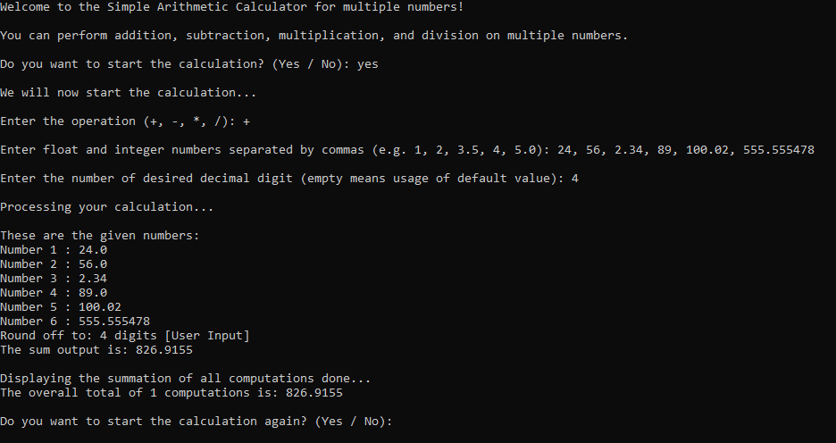

# ⌨ Simple Arithmetic Calculator with Input Error Validation

A minimalist command-line arithmetic calculator built to handle basic operations with strict user input validation. The application securely processes numerical inputs and prevents crashes from invalid data types or mathematical errors.



# Features
**Core Arithmetic:**
Supports addition, subtraction, multiplication, and division.

**Input Error Validation:**
Automatically detects and handles non-numeric inputs, empty values, and division-by-zero errors.

**Error Handling:** 
Prevents runtime crashes from critical errors like division by zero.

**Continuous Execution:**
Features an interactive loop allowing multiple calculations per session.

# Tools
- Python 3.x (Language)
- VSCode (IDE Program)
- Pytest (Unit Test Framework)

# Installation
```bash
git clone https://github.com/SharmJapay/Simple-Arithmetic-Calculator.git
cd ".\Simple Arithmetic Calculator\"
python main.py
```

# Running the Unit Tests
The repository includes a dedicated test scripts (test_calculator.py & test_input_validation.py) built using Python's Unit Test framework named Pytest. These tests verify math accuracy and ensure the input validation mechanisms correctly catch errors.

To run the test suite, execute the following command in your terminal:

```bash
cd ".\Simple Arithmetic Calculator\"
pytest -v
```